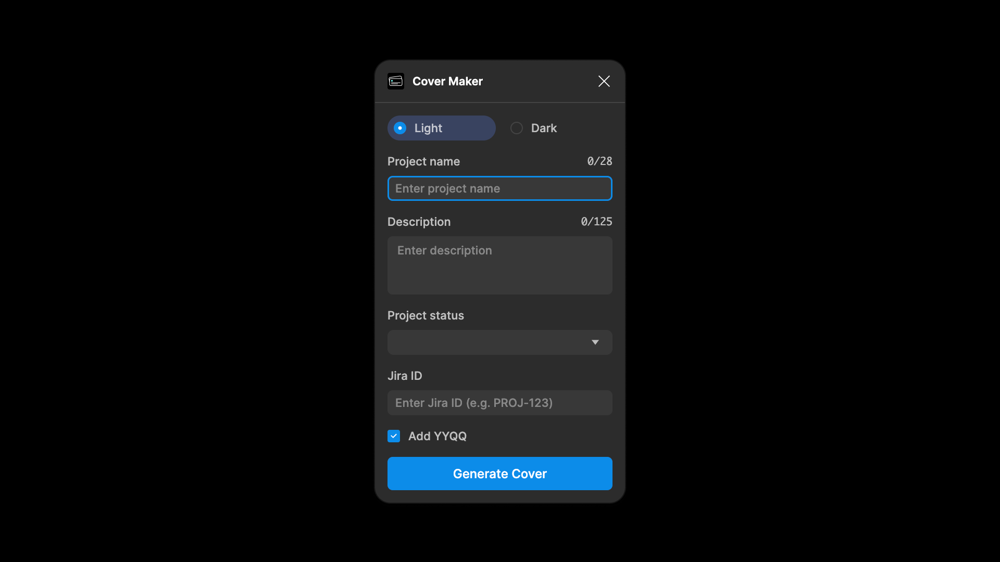

# Figma Cover Maker
A simple cover maker for Figma.

- Input your project title and description
- Adds year/quarter details
- Set project status
- Add Jira ID to display on the cover

[Open in Figma](https://www.figma.com/community/plugin/1460274736428830766/cover-maker)